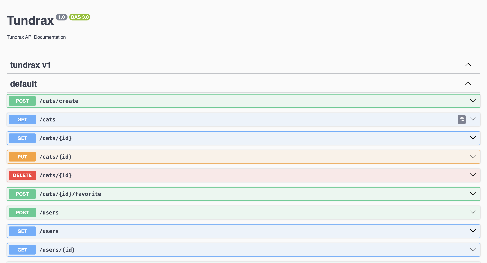

## Tundrax API v-1



The Tundrax API is a RESTful API written in `Typescript`, bootstrapped with the [NestJS](https://docs.nestjs.com) `Nodejs` framework with some key features like cat profile listing, marking cats as favorite, token-based authentication using `passport` and `JWT tokens`, etc.

There are three major technologies worthy of mention, [PostgresDB](https://www.postgresql.org/) as a database, [Type ORM](https://github.com/typeorm/typeorm) as an ORM, [PassportJs](https://docs.nestjs.com/recipes/passport) for token-based authentication.

The API documentation for all available endpoints is designed and made available via the `Swagger UI` and is accessible here:[Tunrax API](http://localhost:3000/tundrax-api#/). Thanks to the Nestjs `Swagger` dependency.

## Installation

To set up the application locally, follow the instructions below

In the project directory, run the command below to install all the required dependencies for the project.

```bash
$ npm install
```

### Environment variable setup

To ensure the application works properly ensure you set the `.env` values properly.

```bash
DB_HOST = localhost;
DB_PORT = 5433;
DB_USERNAME = YOUR_DB_USERNAME;
DB_PASSWORD = YOUR_DB_PASSWORD;
DB_DATABASE = YOUR_DB_PASSWORD;
# set to (true) only in development
SYNCRONIZE_DATABASE = true;
```

## Running the app

Run `npm start` to start the app in the development mode.
All API requests should be directed to [http://localhost:3000](http://localhost:3000).

```bash
# development
$ npm run start

# watch mode
$ npm run start:dev

# production mode
$ npm run start:prod
```

## Test

See the section about [running tests](https://facebook.github.io/create-react-app/docs/running-tests) for more information.
Each file with its corresponding test cases is named with the `.spec.ts` extension.

```bash
# unit tests
$ npm run test

# e2e tests
$ npm run test:e2e

# test coverage
$ npm run test:cov
```

## Support

Nest is an MIT-licensed open-source project. It can grow thanks to the sponsors and support by the amazing backers. If you'd like to join them, please [read more here](https://docs.nestjs.com/support).

Happy Hacking!
